# 🔥 VibeOut: Smart Fitness Companion 🔥

<p align="center">
  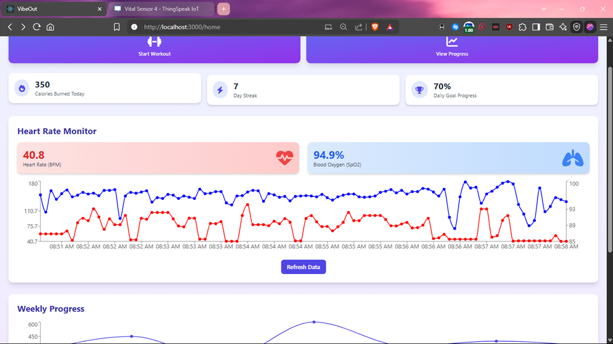
</p>

## 👥 Project Collaborators

<p align="center">
  <table align="center">
    <tr>
      <td align="center">
        <a href="https://github.com/madboy482">
          
          <br />
          <sub><b>madboy482</b></sub>
          <br />
          <sub>Project Lead</sub>
        </a>
      </td>
      <td align="center">
        <a href="https://github.com/krishh-kumarr">
          
          <br />
          <sub><b>krishh-kumarr</b></sub>
          <br />
          <sub>Software</sub>
        </a>
      </td>
      <td align="center">
        <a href="https://github.com/GlitchZap">
          
          <br />
          <sub><b>GlitchZap</b></sub>
          <br />
          <sub>Partner</sub>
        </a>
      </td>
    </tr>
  </table>
</p>

> ## 📱 **An innovative IoT-powered fitness platform that combines emotion recognition with real-time health monitoring for personalized workouts.**


## 💡 Project Overview

VibeOut is an advanced fitness companion that revolutionizes the way we approach personal wellness. Unlike traditional fitness applications that only track physical metrics, this project integrates **emotional intelligence** with **IoT-powered biometric monitoring** to create a truly personalized fitness experience.

This comprehensive solution combines AI-driven emotion recognition technology with ESP32-based IoT sensors to monitor both your mental state and physical vitals in real-time, ensuring safer and more effective workout sessions tailored to your current emotional and physical condition.

<p align="center">
  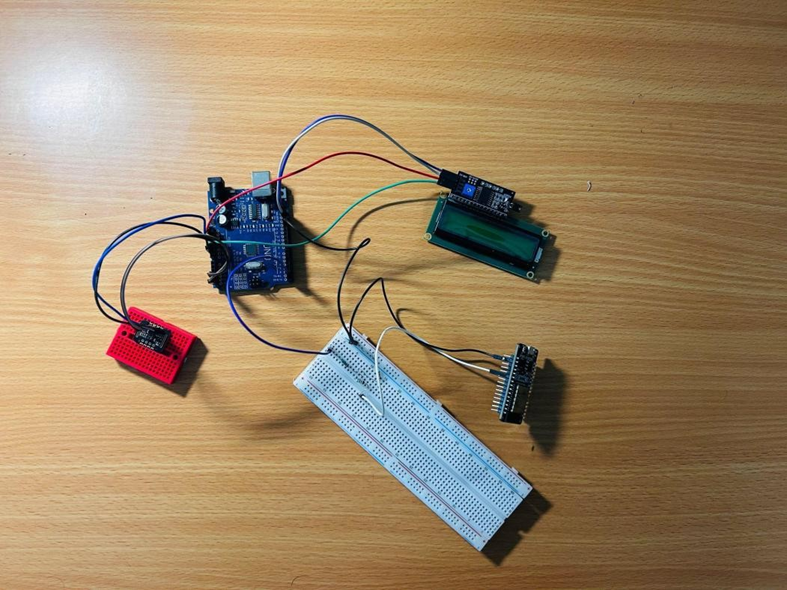
</p>

## 🔧 Hardware & Development Setup

<div align="center">

| IoT Hardware Integration | Development Environment |
|:------------------------:|:------------------------:|
| 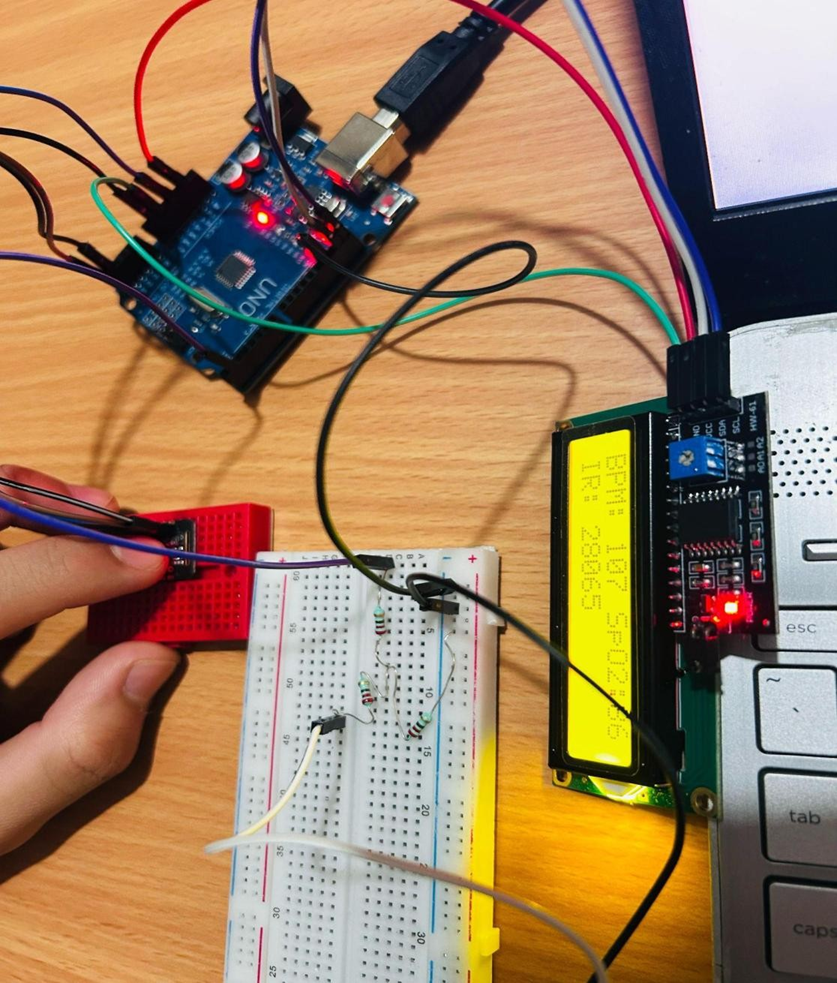 | 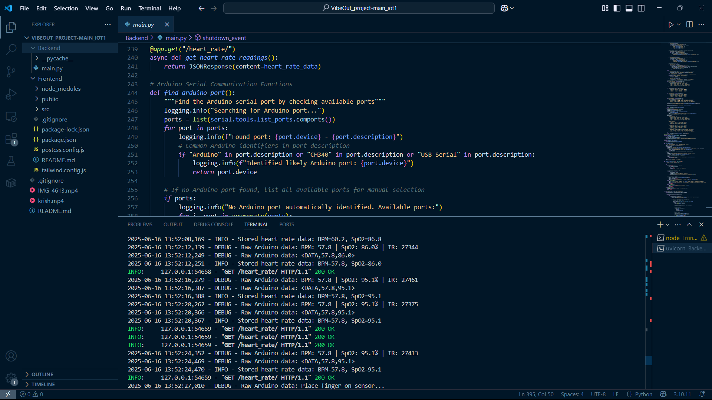 |
| **ESP32 & MAX30102 Sensor Setup** | **Professional Development Environment** |

</div>

## 🏗️ System Architecture

This project implements a sophisticated multi-layered architecture that seamlessly integrates hardware and software components:

1. **IoT Hardware Layer**: ESP32 microcontroller with MAX30102 sensor for real-time biometric data collection
2. **Backend Processing**: FastAPI-based server for data processing, AI analysis, and API management
3. **Frontend Interface**: React-based responsive web application with real-time data visualization
4. **AI Intelligence**: Integrated emotion recognition models for facial expression and voice tone analysis

## 🎯 Problem Statement & Solution

### The Challenge
- **Lack of Emotional Context**: Traditional fitness platforms focus only on physical metrics, ignoring the crucial role of emotional well-being in workout effectiveness
- **Safety Concerns**: Many users push themselves too hard without proper vital sign monitoring, leading to potential health risks
- **Low Engagement**: Generic workout recommendations result in poor user retention and motivation
- **Disconnected Data**: Fitness data often exists in silos without meaningful correlation between mental and physical states

### Our Solution
VibeOut addresses these challenges by creating an intelligent fitness ecosystem that:
- Monitors both emotional and physical states in real-time
- Provides personalized workout recommendations based on comprehensive user data
- Ensures workout safety through continuous vital sign monitoring
- Creates meaningful insights by correlating emotional patterns with physical performance

## ✨ Core Features & Capabilities

### 🤖 AI-Powered Emotion Recognition
- **Facial Expression Analysis**: Advanced CNN models for real-time emotion detection through webcam
- **Voice Emotion Analysis**: LSTM-based models for analyzing emotional states through voice patterns
- **Multi-Modal Integration**: Combines visual and audio inputs for more accurate emotional assessment

### 📡 IoT-Based Health Monitoring
- **Real-Time Vitals**: Continuous heart rate and SpO2 monitoring using MAX30102 sensor
- **ESP32 Integration**: Reliable data transmission with low-latency communication
- **Visual Feedback**: Integrated OLED display for immediate biometric feedback
- **Cloud Analytics**: Data streaming to ThingSpeak platform for advanced trend analysis

<div align="center">
<table>
<tr>
<td width="50%">
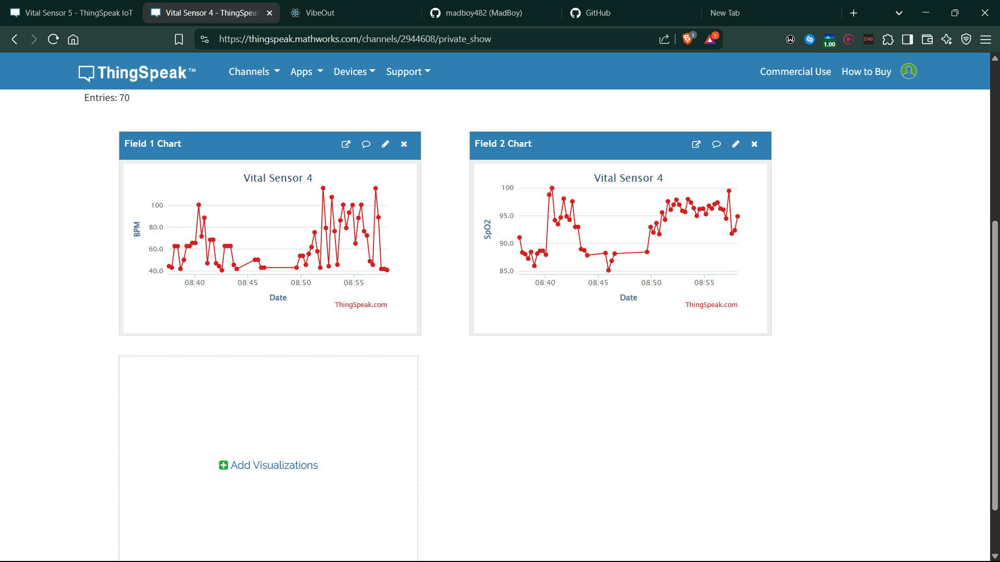
<p><strong>📊 Cloud Data Analytics</strong></p>
</td>
<td width="50%">
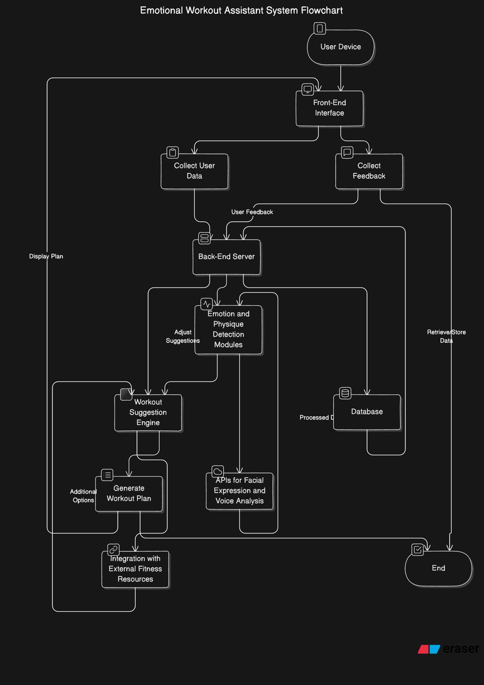
<p><strong>🏗️ System Architecture</strong></p>
</td>
</tr>
</table>
</div>

### 💪 Smart Workout Optimization
- **Adaptive Recommendations**: Personalized exercise plans based on current emotional and physical state
- **Safety Monitoring**: Automatic alerts for dangerous vital sign fluctuations during exercise
- **Performance Tracking**: Comprehensive analytics combining biometric data with emotional patterns
- **Progress Insights**: Long-term trend analysis for continuous improvement

### 🧠 Intelligent Context Awareness
- **Environmental Adaptation**: Adjusts recommendations based on time of day and environmental factors
- **Circadian Rhythm Sync**: Considers natural body rhythms for optimal workout timing
- **Holistic Profiling**: Creates comprehensive wellness profiles updated in real-time
- **Pattern Recognition**: Identifies correlations between emotional states and physical performance

## 🛠️ Technology Stack

### Frontend Development
- **React.js**: Modern component-based UI framework
- **Tailwind CSS**: Utility-first CSS framework for responsive design
- **Real-time Data Visualization**: Interactive charts and graphs for biometric data

### Backend Infrastructure
- **FastAPI**: High-performance Python web framework for API development
- **Real-time Processing**: Efficient handling of continuous IoT data streams
- **RESTful APIs**: Clean, documented API endpoints for frontend communication

### AI & Machine Learning
- **Google Gemini API**: Advanced AI for video and emotion analysis
- **Face-api.js**: Real-time facial emotion recognition in the browser
- **Custom CNN Models**: Trained neural networks for facial expression classification
- **LSTM Networks**: Sequence-based models for voice emotion analysis

### IoT Hardware
- **ESP32 Microcontroller**: Reliable wireless communication and sensor integration
- **MAX30102 Sensor**: Precision heart rate and SpO2 monitoring
- **ThingSpeak Platform**: IoT cloud platform for data analytics and visualization
- **Serial Communication**: Low-latency data transmission protocols

### Development Tools
- **VS Code**: Primary development environment with IoT extensions
- **Arduino IDE**: Hardware programming and debugging
- **Git**: Version control and collaboration

<p align="center">
  
</p>

## 📱 Application Screenshots

<div align="center">

### 🔐 Authentication & Profile Management
<table>
<tr>
<td align="center" width="33%">
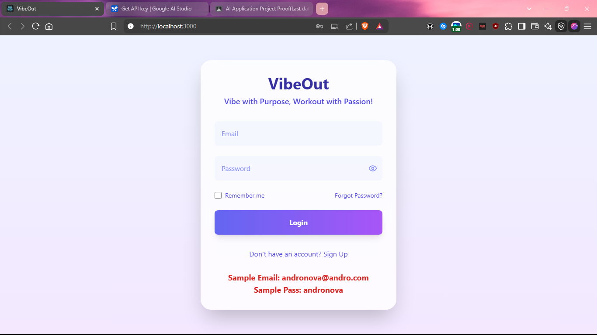
<br><strong>Secure Login System</strong>
</td>
<td align="center" width="33%">
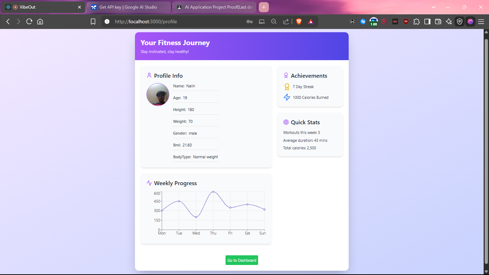
<br><strong>Personal Profile Dashboard</strong>
</td>
<td align="center" width="33%">
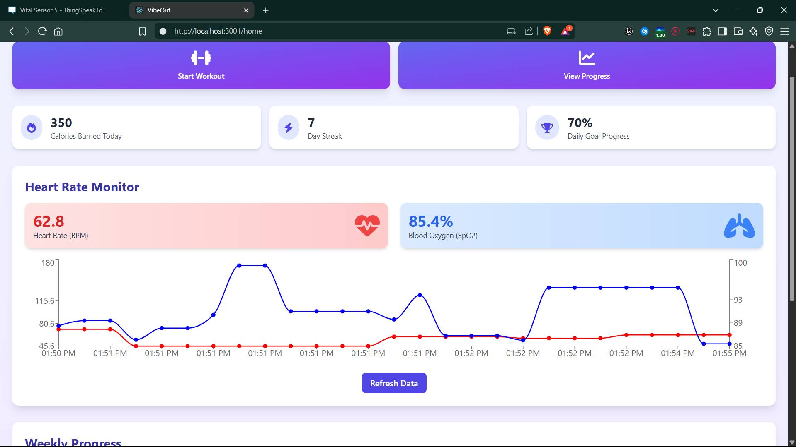
<br><strong>Real-time IoT Dashboard</strong>
</td>
</tr>
</table>

### 📊 Advanced Analytics Suite
<table>
<tr>
<td align="center" width="33%">
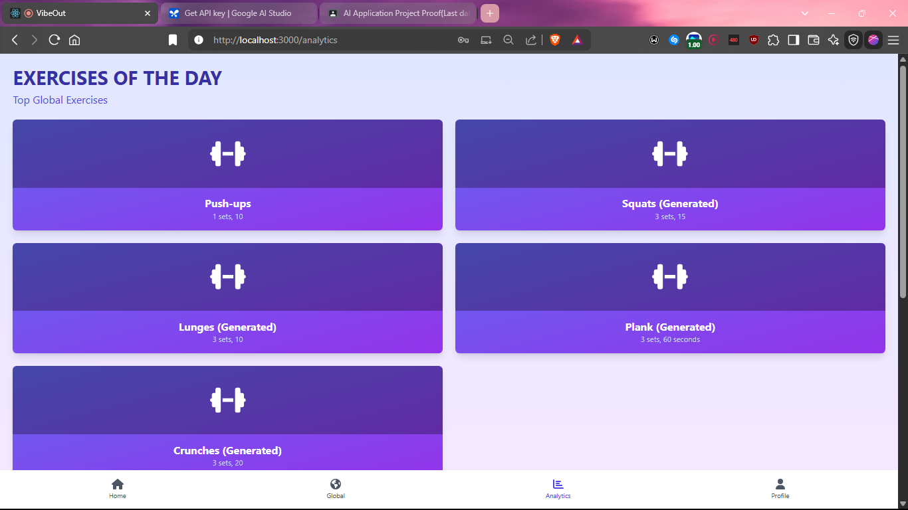
<br><strong>Performance Metrics</strong>
</td>
<td align="center" width="33%">
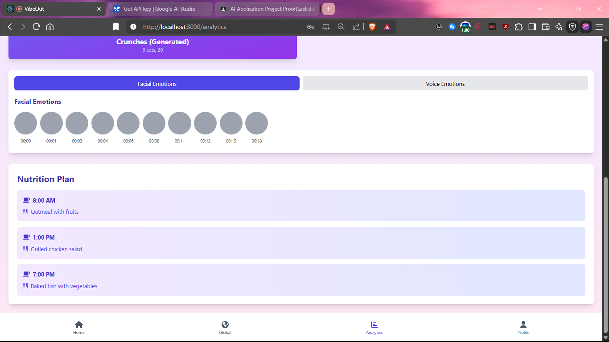
<br><strong>AI Emotion Recognition</strong>
</td>
<td align="center" width="33%">
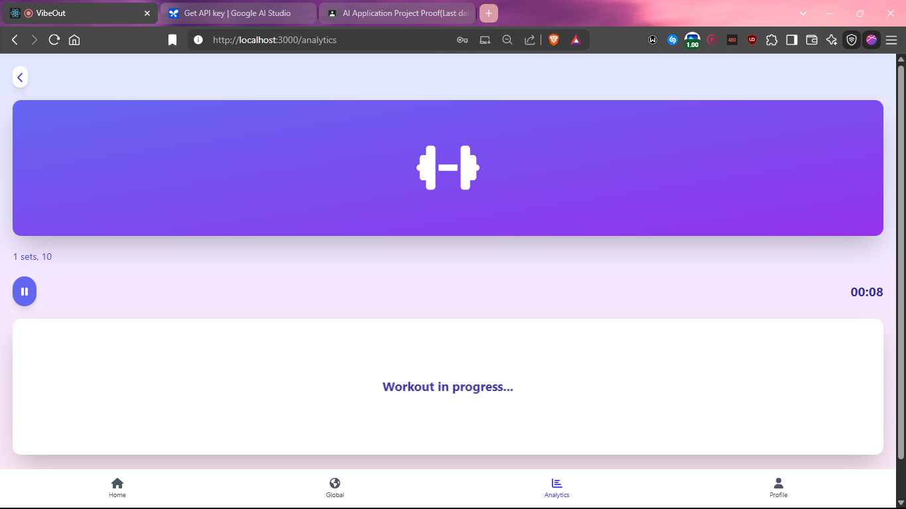
<br><strong>Workout Intelligence</strong>
</td>
</tr>
</table>

</div>

The application features a clean, intuitive interface that seamlessly integrates IoT data with AI-powered insights, providing users with comprehensive fitness and wellness monitoring.

## 📊 Real-Time Health Dashboard

The IoT dashboard represents the core innovation of this project, providing comprehensive real-time health monitoring:

<div align="center">
<table>
<tr>
<td width="60%" align="center">

<br><strong>🔴 LIVE Dashboard Interface</strong>
</td>
<td width="40%" align="center">
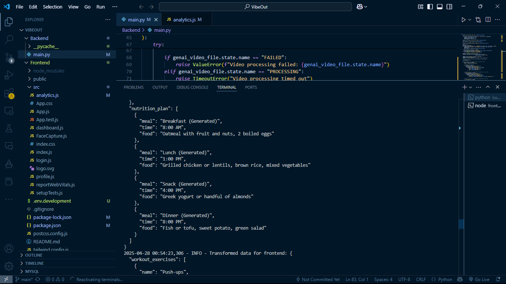
<br><strong>💻 Backend Implementation</strong>
</td>
</tr>
</table>
</div>

### Key Monitoring Features:
- **Heart Rate Tracking**: Continuous BPM monitoring with trend analysis during various workout intensities
- **Blood Oxygen Monitoring**: Real-time SpO2 level tracking to ensure safe exercise parameters
- **Data Visualization**: Interactive graphs displaying vitals over time to identify patterns and health trends
- **Alert System**: Intelligent notifications for abnormal vital sign readings
- **Historical Analysis**: Long-term data storage and trend analysis for health insights

### Technical Implementation:
- Low-latency data transmission from ESP32 to web dashboard
- Real-time chart updates using modern JavaScript libraries
- Responsive design for optimal viewing on various devices
- Integration with ThingSpeak for cloud-based analytics and data backup

## 🌟 Project Impact & Future Development

### Current Impact
- **Enhanced Safety**: Real-time vital monitoring prevents exercise-related health risks
- **Improved Engagement**: Emotion-aware recommendations increase user motivation and retention
- **Holistic Wellness**: Bridges the gap between mental and physical health monitoring
- **Data-Driven Insights**: Provides actionable insights based on comprehensive biometric analysis

### Future Roadmap

#### Phase 1: Hardware Integration
- **Wearable Device Integration**: Compatibility with Fitbit, Apple Watch, and other popular fitness trackers
- **Advanced Sensors**: Integration of additional biometric sensors (skin temperature, galvanic skin response)
- **Miniaturization**: Development of compact, wearable IoT device for continuous monitoring

#### Phase 2: AI Enhancement
- **Advanced NLP**: Implementation of sophisticated natural language processing for deeper emotional analysis
- **Predictive Analytics**: Machine learning algorithms to predict optimal workout times based on historical data
- **Personalization Engine**: Enhanced AI models for more accurate individual recommendations

#### Phase 3: Platform Expansion
- **Mobile Applications**: Native iOS and Android apps with offline capabilities
- **Community Features**: Social challenges and group fitness sessions based on collective emotional trends
- **Multi-language Support**: Expanded voice emotion models for diverse user bases
- **Enterprise Solutions**: B2B SDK for gyms, wellness centers, and healthcare providers

## 🎯 Target Audience & Market

### Primary Users
- **Fitness Enthusiasts (18-45)**: Tech-savvy individuals seeking data-driven workout optimization
- **Health-Conscious Professionals**: Busy professionals requiring efficient, safe exercise solutions
- **Wellness Seekers**: Individuals interested in holistic health monitoring and emotional wellness
- **Recovery Patients**: People undergoing physical therapy or cardiac rehabilitation

### Market Segments
- **B2C Individual Users**: Personal fitness and wellness enthusiasts
- **B2B Healthcare**: Hospitals, rehabilitation centers, and wellness clinics
- **B2B Fitness Industry**: Gyms, personal trainers, and fitness app developers
- **B2B Corporate Wellness**: Companies implementing employee health programs

## 💻 Technical Implementation Details

<div align="center">

### 🔬 Development Workspace
<table>
<tr>
<td width="25%">
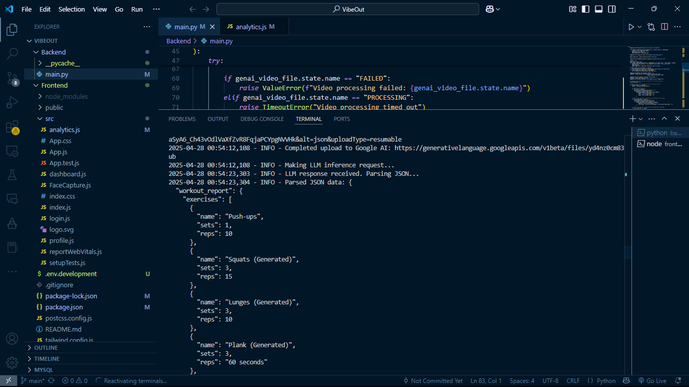
<p><strong>IDE Configuration</strong></p>
</td>
<td width="25%">
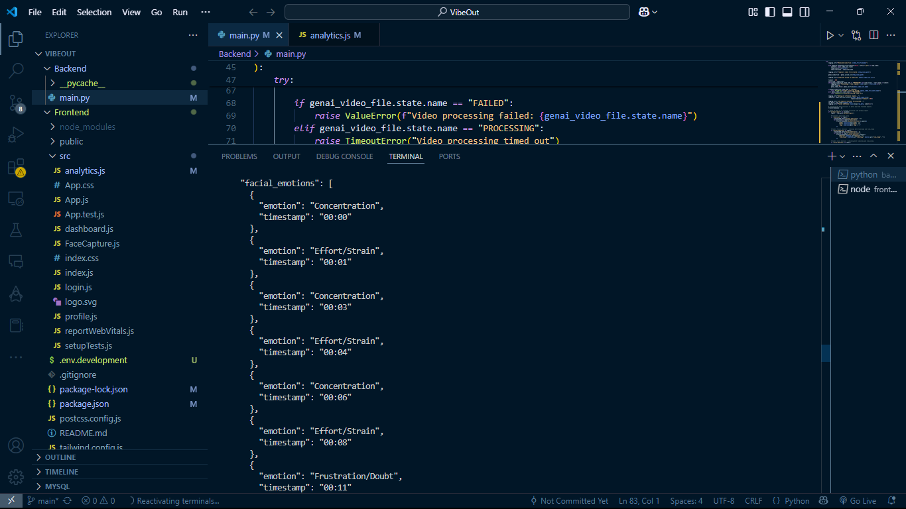
<p><strong>Frontend Development</strong></p>
</td>
<td width="25%">
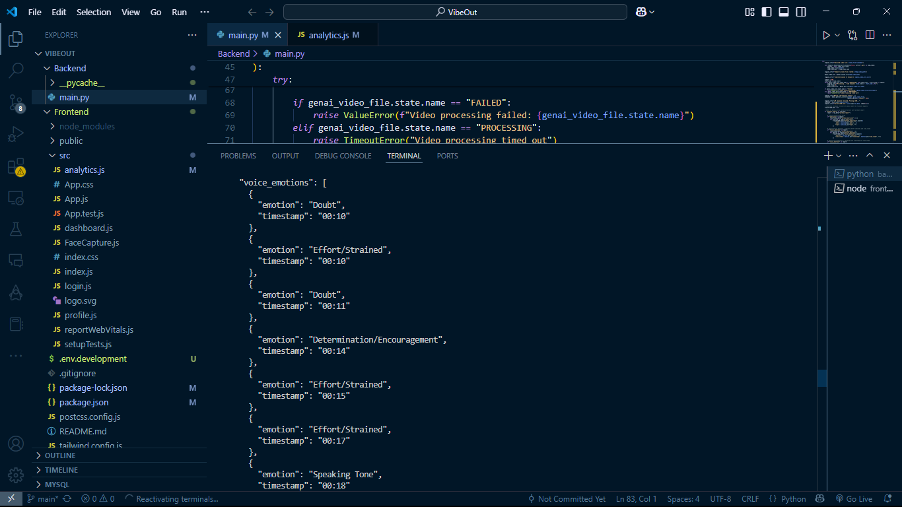
<p><strong>Backend Architecture</strong></p>
</td>
<td width="25%">

<p><strong>IoT Integration</strong></p>
</td>
</tr>
</table>

</div>

### IoT Hardware Implementation
```
Hardware Components:
├── ESP32 Microcontroller
├── MAX30102 Heart Rate & SpO2 Sensor
├── OLED Display (Optional)
└── Power Management System

Data Flow:
1. Sensor data acquisition at 25Hz sampling rate
2. Real-time signal processing and filtering
3. Serial communication to backend server
4. Cloud synchronization with ThingSpeak platform
```

### Backend Architecture
```
API Endpoints:
├── /api/vitals - Real-time biometric data
├── /api/emotion - Emotion analysis results
├── /api/workouts - Personalized recommendations
└── /api/analytics - Historical data and insights

Processing Pipeline:
1. IoT data ingestion and validation
2. AI model inference for emotion detection
3. Data correlation and analysis
4. Recommendation engine processing
5. Real-time dashboard updates
```

### Frontend Components
```
React Component Structure:
├── Dashboard - Main application interface
├── VitalsMonitor - Real-time biometric display
├── EmotionAnalyzer - AI-powered emotion recognition
├── WorkoutPlanner - Personalized exercise recommendations
└── Analytics - Historical data visualization
```

## 🚀 Getting Started

### Prerequisites
- **Hardware Requirements**:
  - ESP32 development board
  - MAX30102 heart rate and SpO2 sensor
  - Jumper wires and breadboard
  - Computer with webcam and microphone

- **Software Requirements**:
  - Node.js (v14 or higher)
  - Python 3.8+
  - Arduino IDE
  - Git

### Installation & Setup

#### 1. Clone the Repository
```bash
git clone https://github.com/krishh-kumarr/VibeOut-IoT.git
cd VibeOut-IoT
```

#### 2. Hardware Setup
```bash
# Upload the IoT code to ESP32
1. Open iot_codes/esp32_vitals.ino in Arduino IDE
2. Configure your WiFi credentials
3. Install required libraries (MAX30105, WiFi)
4. Upload code to ESP32 board
```

#### 3. Backend Setup
```bash
cd backend
pip install -r requirements.txt
python main.py
```

#### 4. Frontend Setup
```bash
cd frontend
npm install
npm start
```

#### 5. Access the Application
- Open your browser and navigate to `http://localhost:3000`
- Ensure your ESP32 is connected and transmitting data
- Grant camera and microphone permissions for emotion analysis

### Configuration
- Update ThingSpeak API keys in the backend configuration
- Configure Google Gemini API credentials for enhanced AI features
- Adjust sensor sampling rates in the ESP32 code as needed

## 🤝 Contributing

I welcome contributions to enhance VibeOut! Whether you're interested in adding new features, improving the AI models, or expanding hardware compatibility, your contributions are valuable.

### How to Contribute
1. Fork the repository
2. Create a feature branch (`git checkout -b feature/amazing-feature`)
3. Commit your changes (`git commit -m 'Add amazing feature'`)
4. Push to the branch (`git push origin feature/amazing-feature`)
5. Open a Pull Request

### Areas for Contribution
- **AI Model Improvements**: Enhance emotion recognition accuracy
- **Hardware Integration**: Add support for new IoT sensors
- **UI/UX Enhancements**: Improve the user interface and experience
- **Documentation**: Help improve project documentation
- **Testing**: Add comprehensive test coverage

## 💪 Experience the Future of Fitness

VibeOut represents the next evolution in personalized fitness technology, where your workout adapts to both your body and your mind. By combining cutting-edge IoT hardware with advanced AI, this project creates a truly intelligent fitness companion.

**Ready to revolutionize your fitness journey? Get started today!**

---

## 📧 Contact

For questions, suggestions, or collaboration opportunities, feel free to reach out:

- **GitHub**: [krishh-kumarr](https://github.com/krishh-kumarr)
- **Project Repository**: [VibeOut-IoT](https://github.com/krishh-kumarr/VibeOut_Iot_Implementation)

## 📜 License

This project is licensed under the MIT License - see the [LICENSE](LICENSE) file for details.

---

<p align="center">
  <strong>⭐ If you find this project helpful, please consider giving it a star! ⭐</strong>
</p>
